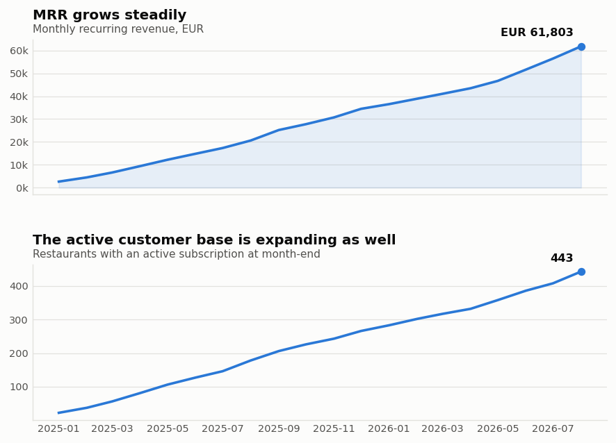
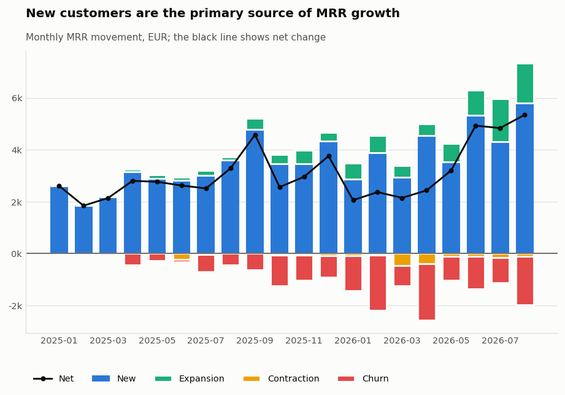
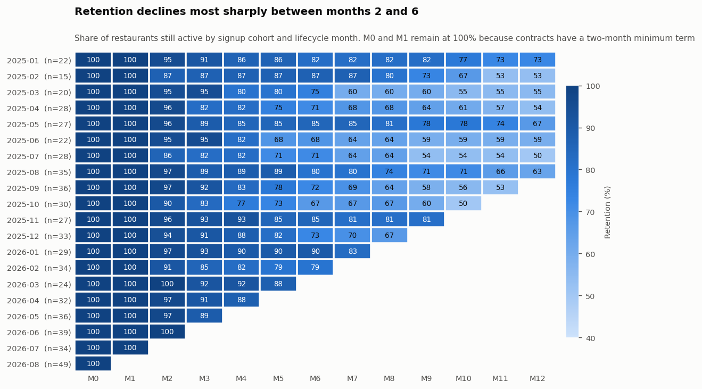
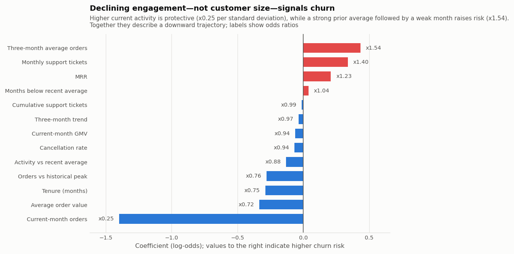
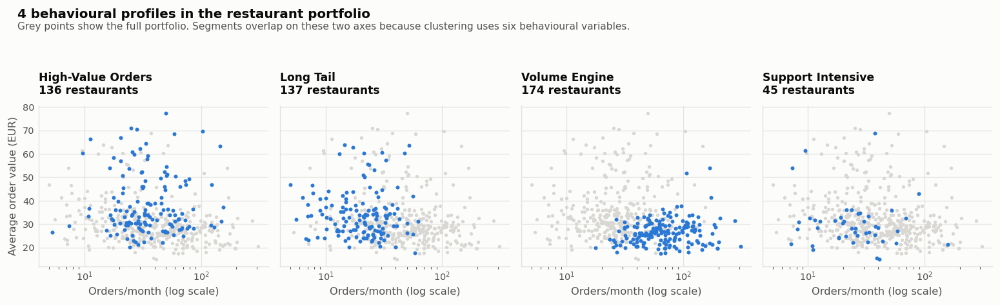
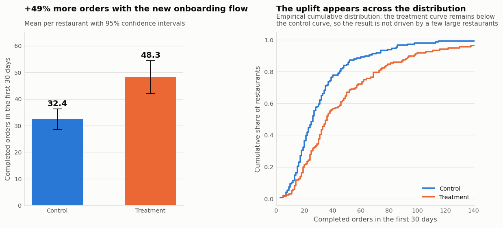
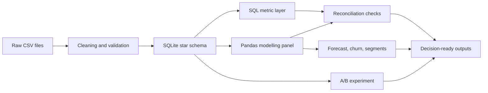

# Restaurant SaaS Analytics

An end-to-end commercial analytics project for a European restaurant software
platform with subscription and transaction-based revenue. The repository turns
deliberately imperfect source files into decision-ready metrics, predictive
models, and a business recommendation from a randomised experiment.

**SQL · Python · pandas · scikit-learn · statistical testing · Power BI design**

> 600 restaurants · 254,131 orders · EUR 7.6M GMV · 20 months · 5 markets

## Executive summary

The business reached **EUR 61,803 in monthly recurring revenue**—equivalent to
**EUR 742K ARR**—with **443 active customers** in August 2026. Growth is strong,
but the MRR bridge shows that it is driven primarily by new customers rather
than expansion within the installed base. Twelve-month average NRR is **98.1%**,
so acquisition remains essential to sustain the current trajectory.

Retention is the clearest commercial opportunity. Average retention falls from
**89% in month 3 to 78% in month 6**, while average monthly customer churn over
the latest twelve months is **4.1%**. A churn model with **0.74 test AUC** makes
that risk actionable: the highest-risk 10% of accounts contains **32% of the
next month's churn**, a **3.2x lift** over random outreach.

Finally, the CMP-003 onboarding experiment produced a material improvement.
Treatment restaurants completed **49% more orders in their first 30 days**
(32.4 to 48.3 orders; 95% CI: +27% to +72%; p < 0.001). Thirty-day GMV rose by
47%, while support demand did not change significantly. The recommended action
is a staged rollout with cost per activated customer added to the measurement
plan.

## Business questions

This project is organised around questions that finance, product, and commercial
teams could act on:

1. How are MRR, GMV, active customers, and total revenue evolving?
2. Is growth coming from acquisition, expansion, reactivation, or contraction?
3. At which lifecycle stage does retention deteriorate?
4. Which accounts should a capacity-constrained retention team contact first?
5. Which behavioural segments require different commercial playbooks?
6. Did the new onboarding flow improve activation without increasing support load?

## Key findings

### 1. MRR is growing, but mainly through acquisition

Average monthly MRR growth over the latest six months is **8.0%**. Expansion
revenue is limited, which leaves the business exposed if new-customer acquisition
slows.





### 2. The largest retention loss occurs between months 2 and 6

The onboarding period itself is comparatively stable. The sharper decline
appears in the following quarter, suggesting that lifecycle interventions should
focus on adoption and value realisation after initial setup.



### 3. Declining engagement is an early warning of churn

The churn model is designed for prioritisation rather than automated decisions.
Recent activity relative to a restaurant's own baseline is more informative than
absolute customer size. All coefficients are exported for inspection, and the
README reports the operational metric that matters most: churn captured within
the top-risk 10%.



### 4. Four behavioural segments support distinct playbooks

| Segment | Restaurants | Avg. monthly orders | Avg. order value | Historical churn |
|---|---:|---:|---:|---:|
| Volume Engine | 174 | 79 | EUR 27 | 18% |
| High-Value Orders | 136 | 42 | EUR 38 | 24% |
| Support Intensive | 45 | 31 | EUR 30 | 29% |
| Long Tail | 137 | 23 | EUR 34 | **39%** |

The segments overlap rather than forming naturally isolated clusters. Four were
selected as a practical number of commercial playbooks, and that judgement is
documented explicitly instead of being presented as a purely data-driven truth.



### 5. The new onboarding flow improved early product adoption

The experiment includes sample-ratio and covariate-balance checks, Welch's
t-test, a Mann-Whitney robustness test, covariate-adjusted OLS, secondary
outcomes, a support guardrail, and a minimum detectable effect calculation.



The complete business-facing recommendation is available in
[`outputs/onboarding_experiment_brief.md`](outputs/onboarding_experiment_brief.md).

## Analytical workflow



## Repository structure

```text
restaurant-saas-analytics/
├── 01_data/
│   ├── generate_raw_data.py      # Synthetic source-system extracts
│   ├── clean_data.py             # Cleaning, standardisation, and QA
│   └── build_sqlite.py           # Star-schema load and integrity checks
├── 02_sql/
│   ├── 00_schema.sql             # Grain, definitions, and portability notes
│   ├── 01_exploration.sql        # Core aggregation and CASE patterns
│   ├── 02_joins.sql              # Customer, subscription, and campaign views
│   ├── 03_cte_windows.sql        # CTEs and analytical window functions
│   ├── 04_saas_metrics.sql       # MRR, ARPU, churn, NRR, and revenue
│   ├── 05_cohorts.sql            # Retention and survival analysis
│   ├── 06_experiment.sql         # Experiment aggregates
│   └── run_sql.py                # Query runner and CSV export
├── 03_python/
│   ├── 01_panel_and_metrics.py   # Modelling panel and SQL reconciliation
│   ├── 02_models.py              # GMV forecast, churn model, and clustering
│   └── viz_style.py              # Shared accessible chart style
├── 04_experiment/
│   └── ab_test_onboarding.py     # Experiment inference and business brief
├── 05_powerbi/
│   ├── 01_star_schema.md         # Relationships and model design
│   ├── 02_power_query_steps.md   # Reproducible Power Query transformations
│   ├── 03_dax_measures.md        # DAX measure library
│   └── 04_dashboard_guide.md     # Three-page dashboard specification
├── data/raw/                     # Deliberately imperfect source files
├── data/clean/                   # Validated analytical layer and panel
├── outputs/                      # Query results, model artefacts, and figures
├── 4_WEEK_LEARNING_PATH.md       # Guided exercises using this repository
├── requirements.txt
└── run_all.py                    # Full reproducible pipeline
```

The Power BI folder contains a complete model, transformation, measure, and
dashboard blueprint. A `.pbix` binary is intentionally not included.

## Run the project

Python 3.11 or later is recommended.

```bash
python3 -m venv .venv
source .venv/bin/activate
python3 -m pip install -r requirements.txt
python3 run_all.py
```

The full pipeline regenerates the raw extracts, cleans the data, rebuilds the
SQLite database, executes every SQL query, trains the models, runs the experiment,
and recreates all outputs.

To run individual stages:

```bash
python3 01_data/generate_raw_data.py
python3 01_data/clean_data.py
python3 01_data/build_sqlite.py
python3 02_sql/run_sql.py
python3 03_python/01_panel_and_metrics.py
python3 03_python/02_models.py
python3 04_experiment/ab_test_onboarding.py
```

The generated SQLite database is excluded from version control. Rebuild it with
`python3 run_all.py`, or query it after generation with:

```bash
sqlite3 db/restaurant_saas.db < 02_sql/04_saas_metrics.sql
```

## Methodological choices

- **Independent metric reconciliation.** MRR and active-customer counts are
  implemented separately in SQL and pandas. The pipeline fails if the two
  results disagree beyond the defined tolerance.
- **Explicit business definitions.** Active customers are measured at month-end,
  and monthly churn uses the previous month-end base as its denominator. These
  conventions live in `02_sql/00_schema.sql`.
- **Time-aware validation.** The GMV model trains through April 2026 and tests on
  later months. This prevents future periods from leaking into the training set.
- **Leakage-safe preprocessing.** Scaling and one-hot encoding remain inside the
  scikit-learn pipelines and are fitted independently within validation folds.
- **Baseline comparison.** The GMV model is tested against the transparent rule
  “next month equals this month.” Its MAE improvement is modest, which is reported
  openly rather than hidden behind a strong R².
- **Imbalance-aware churn evaluation.** Because churn is uncommon, model quality
  is assessed with AUC, average precision, recall, and top-decile capture—not
  accuracy alone.
- **Pragmatic segmentation.** Silhouette scores are flat across plausible values
  of k. Four segments are retained for commercial usability, with this limitation
  recorded in the output.
- **Experiment checks before outcomes.** Sample ratio mismatch and covariate
  balance are reviewed before treatment effects. The adjusted model improves
  precision; it is not presented as a remedy for failed randomisation.

## Data quality and reproducibility

All data is **synthetic** and generated with a fixed seed. No restaurant or
customer is real. The simulation includes seasonality, adoption ramps, plan
changes, discounts, support demand, and a latent customer-health process that
creates realistic pre-churn decline.

The raw layer is intentionally messy: dates use multiple formats, market codes
appear in several variants, some decimal values use commas, currency symbols are
embedded in text, nulls appear as strings, duplicate rows are present, and
categorical values use inconsistent case. Cleaning these issues is part of the
analysis rather than a hidden prerequisite.

Because the data-generating process is known, the experiment also has a ground
truth. The programmed onboarding effect is +35%; the estimated +49% uplift has a
95% confidence interval that contains that true value. This illustrates why the
interval is more informative than the point estimate alone.

## Limitations

- Twenty months of observations are insufficient for robust year-over-year
  seasonality estimates.
- Logistic regression favours interpretability; a more complex model could
  improve discrimination at the cost of transparency.
- The project does not include acquisition or service-cost data, so LTV/CAC and
  experiment ROI cannot be estimated responsibly.
- Synthetic evidence demonstrates analytical technique, not external validity
  for a real company or market.

## Author

**Mayte Cabrera** · [GitHub](https://github.com/meicm94)
