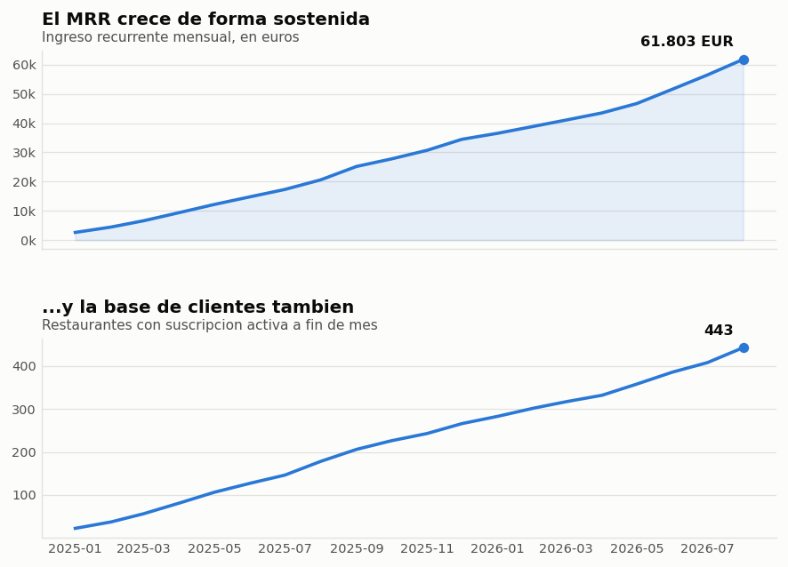
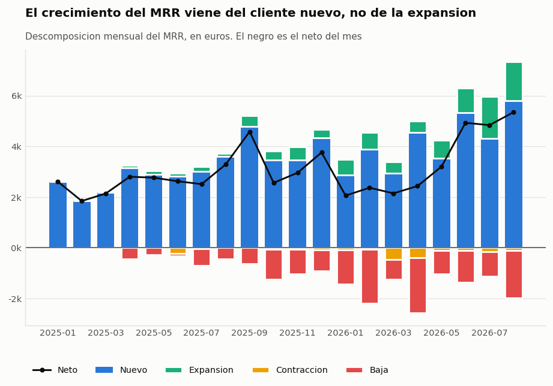
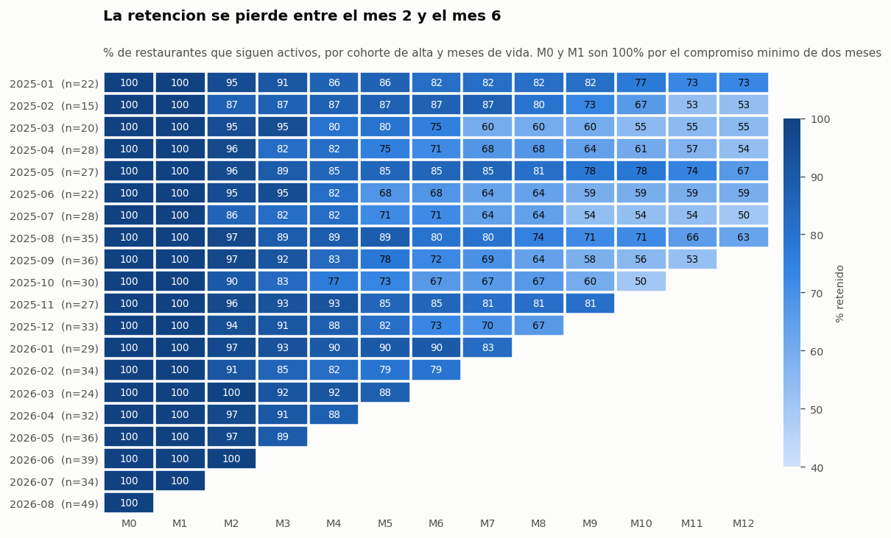
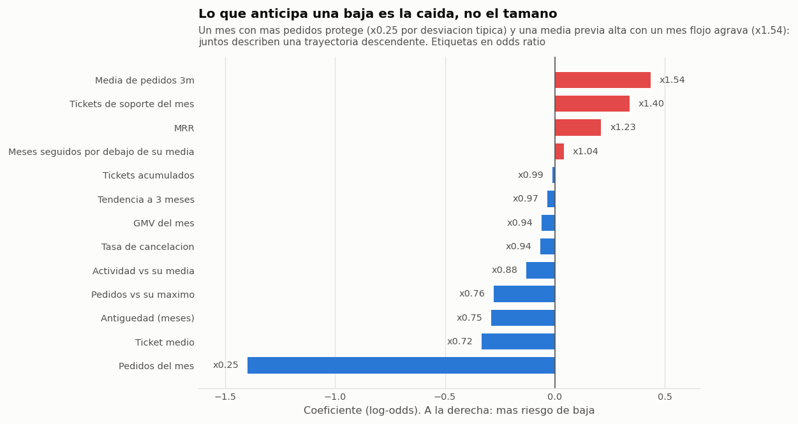
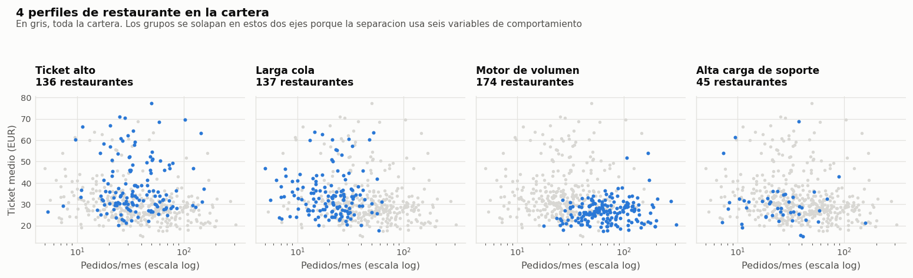
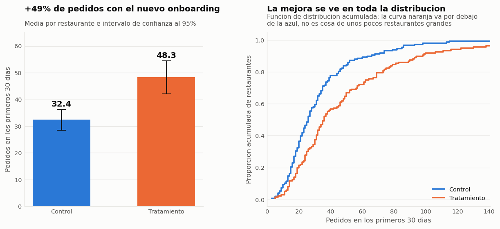

# Restaurant SaaS · Revenue, Retention & Experimentation Analytics

Analítica de negocio de extremo a extremo para una plataforma SaaS que vende a
restaurantes un sistema de pedidos online de marca propia: los restaurantes pagan
una **suscripción mensual** y la plataforma cobra además una **comisión sobre el
GMV** que procesan.

El proyecto recorre el ciclo completo: datos crudos sucios → limpieza → SQL →
modelo semántico y DAX → modelos predictivos → un experimento A/B leído y
convertido en recomendación de negocio.

**600 restaurantes · 254.131 pedidos · 7,6 M€ de GMV · 20 meses (2025-01 a 2026-08) · 5 mercados europeos**

---

## Las cinco conclusiones

**1. El crecimiento es sano, pero depende por completo del cliente nuevo.**
El MRR llega a **61.803 €** (ARR de 742 K€) con **443 restaurantes activos**, y crece
un **8,0 % mensual** de media en los últimos seis meses. Casi todo ese crecimiento
es MRR nuevo: la expansión de la cartera existente aporta muy poco y el NRR se queda
en **98,1 %**. Traducido: si se seca la captación, el negocio deja de crecer al mes
siguiente.




**2. La retención se pierde entre el mes 2 y el mes 6.**
De cada 100 restaurantes que entran, **89 siguen a los 3 meses y 78 a los 6**. El
churn mensual medio del último año es del **4,1 %**. La caída no está en el arranque
—el onboarding funciona— sino en el trimestre siguiente, que es justo donde hoy no
hay ninguna acción comercial.



**3. La baja se puede anticipar con un mes de margen.**
Una regresión logística sobre el panel restaurante-mes alcanza **AUC 0,74** en los
meses de prueba. Ordenando la cartera por riesgo, **el 10 % con más riesgo concentra
el 32 % de las bajas del mes siguiente**: llamar a esa lista es **3,2 veces más
eficaz** que llamar al azar. Lo que predice la baja no es el tamaño, sino la
*trayectoria*: la caída de pedidos respecto a la media reciente del propio
restaurante, y los tickets de soporte.



**4. La cartera se gestiona mejor en cuatro grupos.**

| Segmento | Restaurantes | Pedidos/mes | Ticket medio | % que acaba de baja |
|---|---|---|---|---|
| Motor de volumen | 174 | 79 | 27 € | 18 % |
| Ticket alto | 136 | 42 | 38 € | 24 % |
| Alta carga de soporte | 45 | 31 | 30 € | 29 % |
| Larga cola | 137 | 23 | 34 € | **39 %** |

La larga cola concentra el riesgo con el MRR más bajo: es el segmento donde una
subida de precio o un servicio más automatizado tienen más sentido.



**5. El nuevo onboarding funciona, y bastante.**
En el experimento aleatorizado CMP-003, los restaurantes con el nuevo flujo hicieron
**un 49 % más de pedidos en sus primeros 30 días** (32,4 → 48,3 pedidos; IC 95 % del
+27 % al +72 %; p < 0,001). El GMV a 30 días sube un **47 %** y la activación a 7 días
pasa del 93,9 % al 100 %. El guardarraíl —tickets de soporte— no empeora (p = 0,64).
**Recomendación: desplegar por mercados de forma escalonada**, midiendo además el
coste por alta.



---

## Qué hay en el repositorio

```
restaurant-saas-analytics/
├── 01_data/                 generación, limpieza y carga
│   ├── generate_raw_data.py     simula el negocio y escribe CSV crudos (sucios a propósito)
│   ├── clean_data.py            limpieza equivalente a los pasos de Power Query
│   └── build_sqlite.py          carga la capa limpia y comprueba integridad
├── 02_sql/                  biblioteca SQL comentada (31 consultas)
│   ├── 00_schema.sql            modelo, convenciones y notas de portabilidad a T-SQL/Fabric
│   ├── 01_exploration.sql       SELECT, WHERE, GROUP BY, CASE, HAVING
│   ├── 02_joins.sql             INNER, LEFT y anti-joins
│   ├── 03_cte_windows.sql       CTE, LAG, RANK, NTILE, medias móviles
│   ├── 04_saas_metrics.sql      MRR, ARPU, GMV, movimiento de MRR, churn, NRR
│   ├── 05_cohorts.sql           cohortes de retención y supervivencia por mercado
│   ├── 06_experiment.sql        lectura del experimento en SQL
│   └── run_sql.py               ejecuta todo y exporta cada resultado a CSV
├── 03_python/               pandas y scikit-learn
│   ├── 01_panel_y_metricas.py   panel restaurante-mes + contraste pandas vs SQL
│   └── 02_modelos.py            regresión, clasificación y clustering
├── 04_experiment/
│   └── ab_test_onboarding.py    SRM, equilibrio, t de Welch, OLS, potencia y ficha de negocio
├── 05_powerbi/              lo que no cabe dentro de un .pbix
│   ├── 01_modelo_estrella.md    relaciones, cardinalidades y por qué la de fechas es inactiva
│   ├── 02_power_query_steps.md  código M paso a paso y trampas de configuración regional
│   ├── 03_dax_medidas.md        biblioteca de medidas DAX comentada
│   └── 04_guia_dashboard.md     tres páginas, tres preguntas
├── data/raw/                CSV crudos (fechas en dos formatos, comas decimales, duplicados)
├── data/clean/              capa limpia + panel restaurante-mes
├── db/restaurant_saas.db    base SQLite lista para consultar
└── outputs/                 figuras, resultados de las 31 consultas y JSON de métricas
```

## Cómo ejecutarlo

```bash
pip install -r requirements.txt
python run_all.py          # todo, en orden, unos 20 segundos
```

O paso a paso:

```bash
python 01_data/generate_raw_data.py         # datos crudos
python 01_data/clean_data.py                # limpieza
python 01_data/build_sqlite.py              # base de datos
python 02_sql/run_sql.py                    # 31 consultas -> outputs/sql_results/
python 03_python/01_panel_y_metricas.py     # panel + métricas + figuras 1-3
python 03_python/02_modelos.py              # modelos + figuras 4-7
python 04_experiment/ab_test_onboarding.py  # experimento + figura 8
```

Consultar la base directamente:

```bash
sqlite3 db/restaurant_saas.db < 02_sql/04_saas_metrics.sql
```

---

## Decisiones de método que se pueden defender en una entrevista

**Las métricas se calculan dos veces, por dos caminos.** El MRR y los clientes
activos se calculan en SQL y otra vez en pandas, y el script falla si no
coinciden al céntimo. Es la forma barata de detectar que una misma definición se
ha implementado de dos maneras distintas.

**Las definiciones están escritas, no supuestas.** «Activo en el mes M» es la
foto a último día de mes; el churn del mes M se divide entre la base al cierre de
M-1. Con otra convención salen otros números, y por eso la convención vive en
`02_sql/00_schema.sql`.

**Partición temporal, no aleatoria.** Con datos de panel, una partición aleatoria
mete filas del mismo restaurante en entrenamiento y en prueba, y filtra
información del futuro. Aquí se entrena hasta abril de 2026 y se valida de mayo
en adelante.

**Todo el preprocesado va dentro del `Pipeline`.** Escalar o codificar antes de
la validación cruzada contamina cada pliegue con la media del conjunto completo.

**Siempre hay una línea base.** La regresión de GMV se compara con «el mes que
viene será como este»: el modelo la mejora solo un **1,8 % de MAE**. Es un
resultado honesto y útil —el mes anterior ya contiene casi toda la información— y
evita presentar un R² de 0,87 como si fuera mérito del modelo.

**Con clases desbalanceadas no se mira la exactitud.** Con un 3,5 % de bajas,
predecir «no se va nadie» acierta el 96,5 %. Por eso se usa `class_weight`
balanceado y se reportan AUC, precisión-recall y —sobre todo— cuántas bajas se
capturan si el equipo solo puede llamar al 10 % de la cartera.

**El número de clusters no lo eligen los datos.** La silueta es plana (~0,14)
para cualquier k entre 2 y 6: la cartera es un continuo, no tiene grupos
naturales. Se fija k = 4 por criterio de negocio —los playbooks que el equipo
comercial puede mantener— y se dice explícitamente, en lugar de disfrazarlo de
hallazgo.

**En el experimento, primero las comprobaciones.** Antes de mirar el resultado:
reparto de la muestra (SRM) y equilibrio de covariables (máxima diferencia
estandarizada de 0,08, muy por debajo del 0,10 habitual). El OLS con covariables
no corrige un sesgo —la aleatorización ya lo hace—, sino que reduce la varianza.

**Y se dice también lo que el experimento NO puede ver.** Con 284 restaurantes
solo se detectan efectos del 31 % o mayores con una potencia del 80 %. Para
confirmar un +10 % harían falta unos 1.400 restaurantes por grupo. «No
significativo» no habría querido decir «no funciona».

---

## Sobre los datos

Los datos son **sintéticos**, generados por `01_data/generate_raw_data.py` con
semilla fija, y ningún restaurante es real. La simulación incluye estacionalidad
mensual y semanal, curva de arranque, cambios de plan, descuentos, tickets de
soporte y una «salud» latente que hace que los negocios se apaguen antes de
cancelar.

Los CSV crudos vienen **sucios a propósito**: fechas en dos formatos, códigos de
mercado en tres variantes, decimales con coma en cuatro de los ficheros
mensuales, importes con la divisa pegada, nulos escritos como `"NULL"`, filas
duplicadas y estados en mayúsculas y minúsculas. La limpieza forma parte del
proyecto; no es un paso que se dé por hecho.

Que los datos sean simulados tiene una ventaja poco habitual: **se conoce la
respuesta correcta**. El efecto real del nuevo onboarding programado en el
generador es **+35 %**; el experimento lo estima en **+49 %, con un intervalo del
+27 % al +72 %** que contiene el valor verdadero. Es la mejor ilustración posible
de por qué se reporta un intervalo y no un punto.

*(Los comentarios del código van sin tildes, a propósito, para que los ficheros
`.py` y `.sql` sean seguros en cualquier codificación y consola.)*

## Limitaciones

- Un solo periodo de 20 meses: no hay histórico suficiente para medir
  estacionalidad interanual con solidez.
- El modelo de baja usa regresión logística por interpretabilidad; un gradient
  boosting subiría el AUC unas centésimas a cambio de perder la lectura directa
  de los coeficientes.
- El informe de Power BI está documentado (modelo, M y DAX) pero no se incluye el
  `.pbix`, que es un binario.
- No hay datos de coste (CAC, coste de servir), así que no se calculan LTV/CAC ni
  el retorno del experimento.
